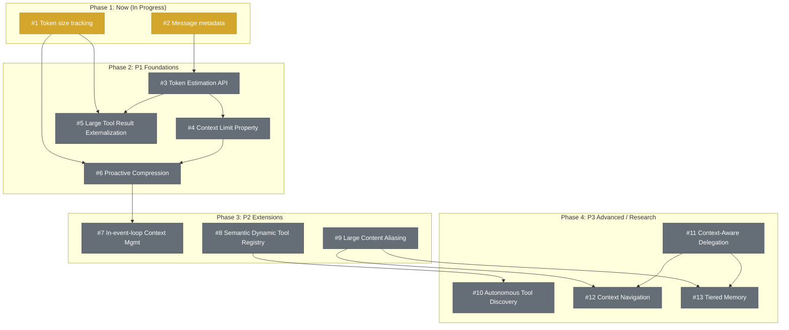

# Strands Context Management - Roadmap Proposal

- [Strands Context Management - Roadmap Proposal](#strands-context-management---roadmap-proposal)
  - [Overview](#overview)
  - [All Tasks](#all-tasks)
  - [Timeline \& Dependencies](#timeline--dependencies)
  - [Key Design Principles](#key-design-principles)
  - [Measuring Success](#measuring-success)
  - [Appendix: Real-World Examples](#appendix-real-world-examples)

---

## Overview

This project addresses context management improvements in Strands as outlined in @dea's [Strands Context Management Proposal](https://amazon.enterprise.slack.com/docs/T01698U3K1U/F0AC2TT93PA). Context is everything the model sees in a single request: the system prompt, conversation history, tool definitions, and any documents or images. Every model has a finite context window, measured in tokens. When the accumulated context exceeds this limit, the request fails. Context management is the practice of controlling what stays in the active context window versus what is removed, summarized, or stored elsewhere. As conversations grow and agents accumulate tool results and artifacts, something has to give: the question is what to keep, what to remove, and whether removed content should be retrievable later.


Getting this right matters for both performance and cost. Poorly managed context degrades agent quality: irrelevant tools dilute attention and hurt tool selection accuracy, critical earlier context gets lost as conversations grow, and a single oversized tool result can push context into overflow (see [Appendix C](#c-how-fast-context-fills-up-real-token-counts-from-github-issues) for real examples). At the same time, every token in the context window is billed per request, so bloated context compounds costs across every subsequent turn. Several of the proposals here (externalization [#1296](https://github.com/strands-agents/sdk-python/issues/1296), aliasing [#1678](https://github.com/strands-agents/sdk-python/issues/1678), dynamic tool loading [#1677](https://github.com/strands-agents/sdk-python/issues/1677)) directly reduce per-request costs by keeping context lean. Others trade upfront cost (summarization LLM calls [#555](https://github.com/strands-agents/sdk-python/issues/555)) for downstream savings or new capabilities. Cost trade-offs are documented per feature.

Today, Strands offers no first-class support for any of this. Each prompt sends whatever is in the active window without considering relevance. There is no way to dynamically filter tools or manage result sizes — users must handle these problems themselves. Users are already hitting these limitations in practice (see [Appendix A](#a-real-world-context-overflow-errors-from-github-issues)). This project aims to change that.

The work is organized into **3 tracks**, each targeting a different source of context pressure:

- **Conversation Context** — Managing message history as it grows. How to track, estimate, compress, and summarize the conversation itself.
- **Tool Context** — Managing tool definitions and tool results that consume the window. How to reduce the footprint of tools the agent carries and the outputs they produce.
- **Delegation** — Preventing context from accumulating in the first place. How to offload work to sub-agents or external storage so the orchestrator stays lean.

All features with meaningful cost impact are **opt-in** (users must explicitly configure them). No feature in this project increases costs for users who don't opt in.

**SDK coverage:** This roadmap targets the Python SDK first. TypeScript SDK will follow once Python implementations stabilize, unless the team identifies cases where WASM FFI constraints warrant a different approach or parallel development.

---

## All Tasks

Priority reflects both impact and cost, but is constrained by dependency order. **P0 tasks are P0 because they are blockers for everything else** — they're small, shippable now, and unlock the entire roadmap. High-impact features like Proactive Compression ([#555](https://github.com/strands-agents/sdk-python/issues/555)) are P1 rather than P0 because they can't start until the P0 foundations land.

| # | Task | Description | Priority / Size | Cost | Open Questions |
|---|------|-------------|-----------------|------|----------------|
| 1 | **Track agent.messages token size**<br/>Conversation · [#1197](https://github.com/strands-agents/sdk-python/issues/1197) | The single most important prerequisite. Today, Strands has no visibility into how full the context window is. Without this metric, no feature can proactively react to context pressure — compression can't trigger, tools can't be shed, and users get opaque failures when the window overflows. Small in scope (exposing a count) but unlocks everything downstream. | P0 / S | — | — |
| 2 | **Add metadata field to messages**<br/>Conversation · [#1532](https://github.com/strands-agents/sdk-python/issues/1532) | Messages currently have no way to carry annotations like "this was summarized from turns 5-20" or "this is an alias for a large tool result stored externally." Without metadata, compression and aliasing features would need hacky workarounds to track provenance. | P0 / S | — | — |
| 3 | **Token Estimation API**<br/>Conversation · [#1294](https://github.com/strands-agents/sdk-python/issues/1294) | Once we can track current size ([#1197](https://github.com/strands-agents/sdk-python/issues/1197)), we need to predict whether new content will fit before sending it. Token counts vary by model provider (Claude vs GPT tokenizers differ), so this needs a provider-abstracted estimation interface (see [Appendix F](#f-provider-api-coverage-for-context-limits-and-token-estimation) for per-provider feasibility). Without it, proactive compression is guesswork. Shipping this early means every subsequent feature can make cost-aware decisions (e.g., "only compress when at 80% capacity"). This issue has 2 pre-existing upvotes. | P1 / M | — | — |
| 4 | **Context Limit Property on Model Interface**<br/>Conversation · [#1295](https://github.com/strands-agents/sdk-python/issues/1295) | Pairs with [#1294](https://github.com/strands-agents/sdk-python/issues/1294). Knowing "you've used 80k tokens" is useless without also knowing "the limit is 100k tokens." Adds a max-context property to the model interface. Most providers expose this via API; the few that don't can fall back to a community-maintained lookup or a user-configurable override (see [Appendix F](#f-provider-api-coverage-for-context-limits-and-token-estimation) for per-provider details). | P1 / S | — | — |
| 5 | **Large Tool Result Externalization**<br/>Tool · [#1296](https://github.com/strands-agents/sdk-python/issues/1296) | Intercept oversized tool results via existing `AfterToolCallEvent` hooks and replace them with compact references. Depends on token tracking ([#1197](https://github.com/strands-agents/sdk-python/issues/1197)) and estimation ([#1294](https://github.com/strands-agents/sdk-python/issues/1294)) to determine what qualifies as "oversized." No additional LLM calls — pure cost reducer from day one (see [Appendix D](#d-cost-per-token-reference-across-supported-providers)). 3 upvotes. | P1 / M | \$↓ | — |
| 6 | **Proactive Context Compression**<br/>Conversation · [#555](https://github.com/strands-agents/sdk-python/issues/555) | Most requested context feature (6 upvotes). Today, when context fills up, the request simply fails (see [Appendix C](#c-how-fast-context-fills-up-real-token-counts-from-github-issues)). Compression automatically summarizes older messages as the window fills, keeping the agent functional through long conversations. Cost trade-offs detailed in [Appendix E](#e-compression-cost-break-even-analysis). Evicted messages should be recoverable via session snapshots once Python adopts the TS `SessionManager` pattern (see [Appendix G](#g-related-work-outside-this-roadmap)). | P1 / L | \$↕ | Summarization strategy: LLM-based vs extractive, opinionated default vs pluggable. Content ordering: chronological vs attention-favored (start/end). Prompt caching: compression invalidates cache prefixes. Quality: lossy — needs regression detection. Latency: adds a full LLM round-trip per compression. See [Appendix E](#e-compression-cost-break-even-analysis). |
| 7 | **In-event-loop Cycle Context Management**<br/>Conversation · [#298](https://github.com/strands-agents/sdk-python/issues/298) | Addresses the pain point where a single tool call within one agent cycle returns a result so large it blows the context (see [Appendix C](#c-how-fast-context-fills-up-real-token-counts-from-github-issues)). Different from [#555](https://github.com/strands-agents/sdk-python/issues/555) (which handles gradual growth across turns) — this is about managing context within a single execution cycle. Same cost trade-off as [#555](https://github.com/strands-agents/sdk-python/issues/555) (spends tokens to summarize, saves tokens downstream) but triggered mid-cycle. Prevents the costlier alternative: a completely failed request that must be retried from scratch. | P2 / M | \$↕ | — |
| 8 | **Semantic Dynamic Tool Registry**<br/>Tool · [#1677](https://github.com/strands-agents/sdk-python/issues/1677) | Dynamically filter tool definitions sent to the model based on relevance to the current task. Lives in the core SDK's tool registry so filtering happens before the LLM call — no extra round-trip. Net cost decrease for agents with many tools; marginal for agents with few. | P2 / L | \$↕ | Author must pick a default embedding model and decide whether to align with AgentCore Gateway's implementation (easier integration but couples to their choices) or build independently. Should we take a dependency on an embedding library, or use a lightweight local approach? |
| 9 | **Large Content Aliasing for Tool Results**<br/>Tool · [#1678](https://github.com/strands-agents/sdk-python/issues/1678) | Rather than inlining large content (documents, images, big tool results) directly into context, store an alias/reference and let the agent navigate to the full content on demand. Same pattern as [#1296](https://github.com/strands-agents/sdk-python/issues/1296) — a pure cost reducer with no additional LLM calls. Storage backend can start simple (in-memory or local file) and be swapped for session-managed storage once that lands. | P2 / M | \$↓ | — |
| 10 | **Autonomous Tool Discovery Meta-tool**<br/>Tool · [#1680](https://github.com/strands-agents/sdk-python/issues/1680) | A `load_relevant_tools` meta-tool that lets the agent itself decide when it needs more tools. Each call is an additional tool-use turn (input + output tokens), but avoids the ongoing cost of carrying unused tool definitions. Net decrease for agents that would otherwise load everything upfront; unnecessary overhead for small toolsets. P3 because it's less urgent than the foundational pieces. | P3 / L | \$↑ | Author must scope what the meta-tool can discover: only tools from a pre-registered catalog, or also from external sources like MCP servers and APIs? Broader scope is more powerful but adds complexity and security surface. |
| 11 | **Context-Aware Delegation**<br/>Delegation · [#1681](https://github.com/strands-agents/sdk-python/issues/1681) | Extends the existing `use_agent`/`AgentAsTool` with context awareness — not a new tool. Today's delegation can spawn sub-agents but doesn't reason about context pressure. Two gaps: (1) deciding *when* to delegate based on remaining context budget (e.g., "this sub-task will generate heavy tool output, delegate instead of doing it inline"), and (2) controlling *what context* the child inherits (relevant subset vs. full history vs. nothing). Most cost-increasing feature in the project — each delegation spawns a sub-agent with its own LLM calls. The trade-off: the alternative is often "task fails entirely" due to context overflow. P3 because foundational context management features are more urgent. | P3 / L | \$↑↑ | Author must define what triggers delegation: does the agent decide entirely on its own, or do heuristics help (e.g., "delegate if estimated sub-task exceeds X% of remaining context")? How much of the parent's conversation history does the child agent inherit — full context, relevant subset, or nothing? |
| 12 | **Context Navigation Meta-tools**<br/>Delegation · [#1682](https://github.com/strands-agents/sdk-python/issues/1682) | The first feature where "the agent manages its own memory." Tools to search conversation history, retrieve past interactions, and navigate stored context. Each navigation action is an additional tool-use turn plus storage reads. Cost proportional to navigation frequency. P3 because it depends on aliasing ([#1678](https://github.com/strands-agents/sdk-python/issues/1678)) and delegation ([#1681](https://github.com/strands-agents/sdk-python/issues/1681)). | P3 / L | \$↑ | — |
| 13 | **Tiered Memory (MemGPT-inspired)**<br/>Delegation · [#1683](https://github.com/strands-agents/sdk-python/issues/1683) | The capstone feature. OS-like virtual memory: active context (RAM), recall memory (recent history/swap), archival memory (long-term/disk). Content pages between tiers based on relevance. Combines costs from LLM relevance assessment, storage operations, and potential embedding generation. Offset by keeping context lean for long-running agents. P3 because it's the most ambitious feature, depends on nearly everything else, and is informed by active research (MemGPT paper). | P3 / XL | \$↑↑ | Author must define the migration story: users already use Strands multi-agent patterns for delegation. Will tiered memory compose with existing patterns, replace them, or require a breaking change? |

---

## Timeline & Dependencies




---

## Key Design Principles

These four principles are drawn from @dea's [Strands Context Management Proposal](https://amazon.enterprise.slack.com/docs/T01698U3K1U/F0AC2TT93PA), where they serve as the guiding philosophy for how each feature should be designed. The proposal uses them to evaluate trade-offs throughout.

### 1. Paved Paths Over Escape Hatches

The 80% use case should "just work" out of the box. Hooks provide escape hatches for advanced customization, but if users consistently reach for them to solve common problems, that's a signal to pave a proper path.

**What this means in practice**: Rather than expecting users to write custom `AfterToolCallEvent` hooks for oversized results, the SDK should handle this automatically. The escape hatches remain for edge cases, but common outcomes like compression and externalization should be built-in.

**How this shapes the roadmap**: Compression ([#555](https://github.com/strands-agents/sdk-python/issues/555)) and externalization ([#1296](https://github.com/strands-agents/sdk-python/issues/1296)) are prioritized because users are already building custom hooks to solve these problems (see [Appendix A](#a-real-world-context-overflow-errors-from-github-issues)).

### 2. Autonomy Over Configuration

Agents should adapt during execution, not just at startup. Give agents tools to manage their own context rather than relying on static policies. The agent, being closest to the task, is best positioned to decide what's important.

**What this means in practice**: Tool loading shouldn't be a one-time setup — agents should discover and load tools mid-conversation. Context management shouldn't be a static policy (e.g., "always keep the last 50 messages") but should adapt based on the current task.

**How this shapes the roadmap**: This motivates the meta-tools ([#1680](https://github.com/strands-agents/sdk-python/issues/1680)–[#1682](https://github.com/strands-agents/sdk-python/issues/1682)) and the dynamic registry ([#1677](https://github.com/strands-agents/sdk-python/issues/1677)) — giving agents tools to manage their own context rather than relying on framework-level automation alone.

### 3. Research-Backed

Features are grounded in published research, not speculation. Key influences: **MemGPT** (tiered memory with paging → [#1683](https://github.com/strands-agents/sdk-python/issues/1683)), **Lost in the Middle** + **StreamingLLM** (attention patterns that inform compression and context ordering → [#555](https://github.com/strands-agents/sdk-python/issues/555)), **Recursive Language Models** (chunk-and-navigate over dump-into-context → [#1678](https://github.com/strands-agents/sdk-python/issues/1678)), and **Self-RAG** (agent-controlled retrieval → [#1682](https://github.com/strands-agents/sdk-python/issues/1682)).

**How this shapes the roadmap**: The P3 tier (tiered memory, navigation meta-tools) is directly modeled on MemGPT and Self-RAG. The P1 compression design ([#555](https://github.com/strands-agents/sdk-python/issues/555)) must respect attention sink research — never compress the system prompt, and consider content placement, not just content selection. The aliasing pattern ([#1678](https://github.com/strands-agents/sdk-python/issues/1678)) comes from recursive language model insights: let agents navigate large content on demand rather than consuming the full window upfront.

### 4. Provider Agnostic

All context management strategies must work across Bedrock, OpenAI, Anthropic direct, and other providers. No feature can be locked to a single provider or rely on provider-specific capabilities.

**What this means in practice**: Token estimation ([#1294](https://github.com/strands-agents/sdk-python/issues/1294)) must abstract over different tokenizers, context limits ([#1295](https://github.com/strands-agents/sdk-python/issues/1295)) need a per-provider lookup table, and compression can't rely on provider-specific features like Anthropic's prompt caching.

**How this shapes the roadmap**: Every feature in the table is designed to work across all supported model providers. Where managed services like AgentCore offer overlapping capabilities, the SDK provides both an integration path and a fully independent implementation.

---

## Measuring Success

**What success looks like** (acceptance criteria by phase):

- **P0 (Observability):** Token tracking and metadata are available on every agent invocation. Users can inspect context size programmatically without workarounds.
- **P1 (Foundations):** Agents with compression or externalization enabled can complete conversations that previously failed due to context overflow (specifically, the failure categories in [Appendix A](#a-real-world-context-overflow-errors-from-github-issues) are recoverable). No new GitHub issues reporting context overflow for configurations that use these features.
- **P2/P3 (Extensions):** Agents with 20+ tools can operate without loading all tool definitions upfront. Long-running agents (100+ turns) maintain task quality comparable to fresh conversations.

**How we measure** (given constraints): The SDK does not have telemetry, so we cannot directly measure adoption rates, failure reduction, or cost impact across users. Our primary signals are qualitative: GitHub issue volume and upvotes for context-related problems, Slack support questions, and whether users continue building custom workarounds for problems the SDK should solve. We can track download counts and changelog engagement for releases that include these features, but can't attribute usage to specific APIs. If we want quantitative signal in the future, there is the option to partner with AgentCore to measure adoption of Strands context management features for agents deployed through their platform (though this would only cover a subset of users).

---

## Appendix: Real-World Examples

<details>
<summary><b>A. Real-world context overflow errors from GitHub issues</b></summary>

These are actual issues filed by users hitting context limits. They illustrate the concrete pain points this roadmap addresses.

**Hard context limit failures (no recovery):**

- [sdk-python#1912](https://github.com/strands-agents/sdk-python/issues/1912) — `ValidationException: prompt is too long: 248369 tokens > 200000 maximum`. User using AgentCore browser tool hit the limit after accumulated tool results pushed context past 200k tokens. The error was not mapped to `ContextWindowOverflowException`, so the `SlidingWindowConversationManager` never triggered. The reporter notes: *"This is a widespread issue — multiple teams and users are hitting the same ValidationException across #bedrock-interest, #wasabi-interest, #pippin-interest, #kiro-cli-internal-software-builders, #strands-agents-interest, and #bedrock-agents-interest."*
- [sdk-python#1712](https://github.com/strands-agents/sdk-python/issues/1712) — `ValidationException: prompt is too long: 203470 tokens > 200000 maximum`. User with `SummarizingConversationManager` and a shell tool. A single `find` command listing 11,000+ file paths was enough to blow the context limit. Same root cause: error not recognized as overflow, so no recovery triggered.
- [sdk-python#1528](https://github.com/strands-agents/sdk-python/issues/1528) — Context overflow not detected for OpenAI-compatible endpoints wrapping Bedrock. Users on Databricks Model Serving get Bedrock-style errors (`"Input is too long"`, `"too many total text bytes"`) that the OpenAI provider doesn't recognize, so the `SummarizingConversationManager` never fires.
- [sdk-python#152](https://github.com/strands-agents/sdk-python/issues/152) — `input length and max_tokens exceed context limit: 142422 + 64000 > 204658` followed by `RecursionError: maximum recursion depth exceeded`. The overflow triggered a retry loop that recursed until Python itself crashed.
- [sdk-typescript#673](https://github.com/strands-agents/sdk-typescript/issues/673) — TypeScript SDK's `BEDROCK_CONTEXT_WINDOW_OVERFLOW_MESSAGES` is out of sync with Python, meaning overflow patterns recognized in one SDK are missed in the other.

**Single oversized tool results (one call blows context):**

- [sdk-python#981](https://github.com/strands-agents/sdk-python/issues/981) — When a *single* `toolResult` exceeds the context limit, `SummarizingConversationManager.reduce_context()` fails because it assumes overflow comes from accumulated messages, not from one message. There is no recovery path for "this one result is too big."
- [sdk-python#167](https://github.com/strands-agents/sdk-python/issues/167) — Tool response truncation occurs silently. User discovered research tools had been unusable because large results were silently replaced with `"The tool result was too large!"` — with no logging, no notification, and no way to handle it dynamically at runtime.
- [sdk-python#702](https://github.com/strands-agents/sdk-python/issues/702) — `SlidingWindowConversationManager` incorrectly returns "The tool result was too large" when the sliding window size is smaller than the number of messages, even when the tool result itself isn't oversized.

**Broken conversation structure after context reduction:**

- [sdk-python#1610](https://github.com/strands-agents/sdk-python/issues/1610) — Browser Tool + Memory: orphaned `toolUse` blocks cause `ValidationException: The number of toolResult blocks at messages.27.content exceeds the number of toolUse blocks of previous turn`. Works on first message, fails on every subsequent message in the same session.
- [sdk-python#611](https://github.com/strands-agents/sdk-python/issues/611) — `SummarizingConversationManager` throws `ValidationException` after summarization breaks toolUse/toolResult pairs.
- [Slack thread](https://amzn-aws.slack.com/archives/C07FQ6RK37G/p1774022705972589) — User reports the same orphaned-pair pattern: *"The summarizer is compacting older messages and removing an assistant message that had toolUse blocks, while keeping the following tool message with the corresponding toolResult blocks."* This directly motivates treating toolUse/toolResult pairs as atomic units in [#555](https://github.com/strands-agents/sdk-python/issues/555) (Proactive Compression) and using [#1532](https://github.com/strands-agents/sdk-python/issues/1532) (message metadata) to link pairs for integrity enforcement.

**Pattern**: These aren't edge cases. Any sufficiently long or tool-heavy agent conversation will hit one of these failure modes. The P0/P1 tier of this roadmap exists to prevent or recover from every category above.

</details>

<details>
<summary><b>B. Competing framework approaches to context management</b></summary>

How other frameworks handle context management today, and where Strands aims to differentiate:

| Framework | Approach | Limitations |
|-----------|----------|-------------|
| **LangChain** | `ConversationSummaryBufferMemory` — keeps recent messages verbatim, summarizes older ones. Also offers `ConversationTokenBufferMemory` (hard token cutoff) and `ConversationEntityMemory` (entity extraction). | Summarization is LLM-based only (no extractive option). No tool-aware compression — tool pairs can be split. No dynamic tool loading. Memory types are mutually exclusive, not composable. |
| **AutoGen** | `TransformMessages` with `MessageTokenLimiter` and `MessageHistoryLimiter`. Runs transforms as a pipeline before each LLM call. | Token-based truncation only — no summarization, no semantic relevance. Dropped messages are permanently lost (no session bridge). No tool context management. |
| **MemGPT / Letta** | Full tiered memory (main context, recall, archival) with agent-controlled paging. The agent explicitly decides what to page in/out. | Tightly coupled to its own runtime — not usable as a library within other frameworks. Heavy operational footprint (requires vector DB, dedicated server). Research prototype maturity. |
| **CrewAI** | Delegation-first: agents delegate to sub-agents, each with their own context. Short-term, long-term, and entity memory tiers. | Memory is framework-managed, not agent-controlled (violates "autonomy over configuration"). No fine-grained tool context management. |

**Where Strands differentiates**: Provider-agnostic (works across Bedrock, OpenAI, Anthropic direct), composable (mix compression + aliasing + delegation), and agent-controlled (meta-tools let the agent manage its own context rather than relying solely on framework heuristics). The goal is to combine the best ideas from each — LangChain's summarization, MemGPT's tiered memory, CrewAI's delegation — in a modular, opt-in architecture.

</details>

<details>
<summary><b>C. How fast context fills up: real token counts from GitHub issues</b></summary>

These are actual token counts reported by users hitting the 200k context limit on Bedrock:

| Issue | Token count | What caused it |
|-------|-------------|----------------|
| [sdk-python#1912](https://github.com/strands-agents/sdk-python/issues/1912) | **248,369 tokens** | AgentCore browser tool — accumulated tool results from web browsing pushed context 48k past the 200k limit |
| [sdk-python#1712](https://github.com/strands-agents/sdk-python/issues/1712) | **203,470 tokens** | A single `find` command listing 11,000+ file paths — one tool result was enough to exceed the limit |
| [sdk-python#152](https://github.com/strands-agents/sdk-python/issues/152) | **142,422 tokens** (+ 64k max_tokens) | Accumulated context during tool-heavy execution — the 142k input plus 64k reserved for output exceeded the 204,658 token limit, then the retry loop recursed until Python crashed |

**What this tells us**:
- **Tool results are the dominant contributor.** In #1712, a *single* tool result blew the limit. In #1912, accumulated browser results added 48k+ tokens beyond the maximum. This is why externalization ([#1296](https://github.com/strands-agents/sdk-python/issues/1296)) and aliasing ([#1678](https://github.com/strands-agents/sdk-python/issues/1678)) are high-priority.
- **Context growth is non-linear and unpredictable.** An agent can be at 50% capacity one turn and over the limit the next, depending on what a tool returns. This is why proactive compression ([#555](https://github.com/strands-agents/sdk-python/issues/555)) needs to trigger *before* overflow, not after.
- **Recovery doesn't work today.** In #1912 and #1712, the errors weren't even recognized as overflow, so no context reduction was attempted. In #152, the retry loop crashed Python. The P0 observability tasks ([#1197](https://github.com/strands-agents/sdk-python/issues/1197), [#1294](https://github.com/strands-agents/sdk-python/issues/1294), [#1295](https://github.com/strands-agents/sdk-python/issues/1295)) exist to make informed decisions *before* the window fills.

</details>

<details>
<summary><b>D. Cost-per-token reference across supported providers</b></summary>

Input token pricing for Claude models (source: [Anthropic model docs](https://docs.anthropic.com/en/docs/about-claude/models)). These costs apply to every token in the context window on every request, so bloated context compounds across all subsequent turns.

| Model | Input (per 1M tokens) | Output (per 1M tokens) |
|-------|-----------------------|------------------------|
| Claude Opus 4.6 | \$5.00 | \$25.00 |
| Claude Sonnet 4.6 | \$3.00 | \$15.00 |
| Claude Haiku 4.5 | \$1.00 | \$5.00 |

**Worked example using real data**: [sdk-python#1912](https://github.com/strands-agents/sdk-python/issues/1912) reported 248k tokens at overflow. If that agent had been running for 30 turns before hitting the limit, the cumulative input tokens sent across all turns would be in the millions. At Sonnet 4.6 pricing (\$3/MTok), an agent averaging 150k input tokens per turn over 30 turns sends \~4.5M cumulative input tokens = **\$13.50 in input costs for one conversation**. If externalization ([#1296](https://github.com/strands-agents/sdk-python/issues/1296)) keeps context 40% leaner, cumulative input drops to \~2.7M tokens = **\$8.10**, saving **\$5.40 per conversation**. At scale, these savings are material.

**Why this matters for prioritization**: Features that reduce context size (externalization, aliasing, dynamic tool loading) have a direct, measurable cost benefit that scales with usage. Features that increase context cost (delegation, tiered memory) must justify themselves through capability gains (tasks that would otherwise fail) rather than cost savings.

</details>

<details>
<summary><b>E. Compression cost break-even analysis</b></summary>

This appendix provides the cost model behind the claim in [#6 (Proactive Compression)](#all-tasks) that compression has zero impact on short conversations, a net cost decrease for long ones, and a narrow risk window for conversations that trigger compression near their end.

**Setup.** Assume 2k system prompt (S₀), 4k tokens added per turn (T ≈ 500 user + 1,500 assistant + 2,000 tool results), compression at 80% of 200k limit (160k tokens), 80% compression ratio (summary retains 20%), and Sonnet 4.6 pricing ($3/MTok input, $15/MTok output). Parameters derived from [Appendix C](#c-how-fast-context-fills-up-real-token-counts-from-github-issues) and [Appendix D](#d-cost-per-token-reference-across-supported-providers).

**Cost without compression.** At turn *n*, context size is C(n) = S₀ + nT. Cumulative input tokens across N turns:

```
Total_input(N) = N·S₀ + T·N(N+1)/2
```

Cost grows **quadratically** — each new turn pays for all prior context again.

**Compression trigger and cost.** Compression fires when context reaches 160k, at turn ~40 (S₀ + 40×4k ≈ 162k). The summarization call reads 160k tokens and produces a 32k summary:

- Input: 160k × $3/MTok = $0.48
- Output: 32k × $15/MTok = $0.48
- **Total: $0.96**

Post-compression, context drops from 160k to 34k (S₀ + summary). Every subsequent turn saves 126k tokens = **$0.378/turn**. Break-even: $0.96 / $0.378 = **3 turns** post-compression.

**Worked examples.**

| Conversation | Compressions | Net cost impact | Without compression | With compression |
|---|---|---|---|---|
| **< 40 turns** | 0 (threshold not reached) | **$0** | — | — |
| **50 turns** | 1 (at turn 40) | **−$2.82** | $15.45 | $12.63 |
| **100 turns** | 2 (at turns 40, 72) | **−$12.82** | $60.90 | $48.08 |

*Negative = net savings. At 100 turns, context re-fills by turn 72 (34k + 31.5×4k ≈ 160k) → second compression at $0.96, then 28 remaining turns benefit from the reset.*

**Sensitivity.** The 80% compression ratio is the optimistic base case. Break-even degrades at lower ratios, and improves significantly with a cheaper summarization model:

| Variable | Compression cost | Tokens saved/turn | Break-even |
|---|---|---|---|
| 80% ratio (base case) | $0.96 | 126k | 3 turns |
| 60% ratio | $1.44 | 96k | 5 turns |
| 40% ratio | $1.92 | 64k | 10 turns |
| 20% ratio | $2.40 | 32k | 25 turns |
| 80% ratio, Haiku 4.5 summarizer | $0.32 | 126k | 1 turn |

At 40% reduction, break-even extends to 10 turns — still achievable in long conversations, but the margin shrinks. Using Haiku ($1/$5 per MTok) instead of Sonnet for summarization cuts the compression cost by ~3x, making it nearly free relative to the savings.

**Caveats.**

- **Bursty growth**: This model assumes uniform 4k tokens/turn. Real conversations are bursty — [Appendix C](#c-how-fast-context-fills-up-real-token-counts-from-github-issues) shows single tool results can exceed 200k tokens. The uniform model captures general cost dynamics but understates how quickly compression triggers in tool-heavy agents.
- **Overestimated compression cost**: The model sends the full 160k context to the summarizer. In practice, only the older messages being evicted would be summarized, reducing actual cost.
- **Prompt caching interaction**: Providers like Anthropic offer prompt caching (90% input discount on cached tokens). Compression rewrites early messages, invalidating the cache prefix. For users with high cache hit rates and low compression ratios, compression could be a net cost increase even for long conversations. The implementation must detect when prompt caching is active and adjust accordingly.

</details>

<details>
<summary><b>F. Provider API coverage for context limits and token estimation</b></summary>

Feasibility analysis for tasks [#3 (Token Estimation)](#all-tasks) and [#4 (Context Limit Property)](#all-tasks). Both require per-provider support — this table shows what's available natively vs. what needs a fallback.

**Context limits.**

| Provider | Via API? | Endpoint | What it returns |
|---|---|---|---|
| Anthropic | Yes | `GET /v1/models/{model_id}` | `max_input_tokens`, `max_tokens` (separate input/output) |
| Google Gemini | Yes | `GET /v1beta/models/{model}` | `inputTokenLimit`, `outputTokenLimit` |
| Mistral | Yes | `GET /v1/models/{model_id}` | `max_context_length` (single combined value) |
| Cohere | Yes | `GET /v1/models/{model}` | `context_length` |
| Ollama | Yes | `POST /api/show` | `model_info.{arch}.context_length` (e.g., `llama.context_length`) |
| LiteLLM | Yes (local) | `litellm.get_max_tokens(model)` | From community-maintained `model_prices_and_context_window.json` |
| OpenAI | **No** | `GET /v1/models/{model}` returns only `id`, `created`, `owned_by` | Must hardcode from docs |
| Bedrock | **No** | `GetFoundationModel` returns modalities, lifecycle, ARN — no token limits | Must hardcode from docs |

6 of 8 providers expose context limits via API. For OpenAI and Bedrock, the fallback is LiteLLM's `model_prices_and_context_window.json` or a user-configurable `context_limit` override.

**Token estimation.**

| Provider | Pre-request counting? | Method |
|---|---|---|
| Anthropic | Yes (server-side) | `client.messages.count_tokens()` |
| OpenAI | Yes (local) | `tiktoken` library |
| Google Gemini | Yes (server-side) | `client.models.count_tokens()` |
| Mistral | Yes (local) | `mistral-common` library (built on tiktoken) |
| Cohere | Yes (server-side) | `POST /v1/tokenize` |
| LiteLLM | Yes (local) | `litellm.token_counter()` (native per provider, tiktoken fallback) |
| Bedrock | No | Post-response `usage` object only. Use underlying model's tokenizer (e.g., Anthropic's for Claude on Bedrock). |
| Ollama | No | Post-response `prompt_eval_count` only. tiktoken fallback. |

6 of 8 providers support pre-request token counting natively. For Bedrock and Ollama, the underlying model's tokenizer or tiktoken serves as a fallback. Exact accuracy is not required — estimation is used to trigger compression at ~80% capacity, so a 5-10% margin of error is acceptable.

</details>

<details>
<summary><b>G. Related work outside this roadmap</b></summary>

These tasks are owned by other teams/efforts but directly benefit context management. Tracked here for visibility — not scoped into this roadmap.

| Task | How it helps context management | Status / Link |
|---|---|---|
| **Session snapshots & transcripts in Python SDK** | Enables compression (#6) to write a snapshot before evicting messages, making compressed content recoverable. Also provides full message history for Chat UIs. | TS landed ([sdk-typescript#80](https://github.com/strands-agents/sdk-typescript/issues/80), [PR #569](https://github.com/strands-agents/sdk-typescript/pull/569)). Python transcript tracked at [sdk-python#1858](https://github.com/strands-agents/sdk-python/issues/1858). |
| **Sandboxed tool execution** | Tools running in a sandbox can have their output size capped or streamed without risk of blowing the host agent's context in a single call. Reduces the severity of the "one tool result blows context" problem ([Appendix A](#a-real-world-context-overflow-errors-from-github-issues)). | — |

</details>

